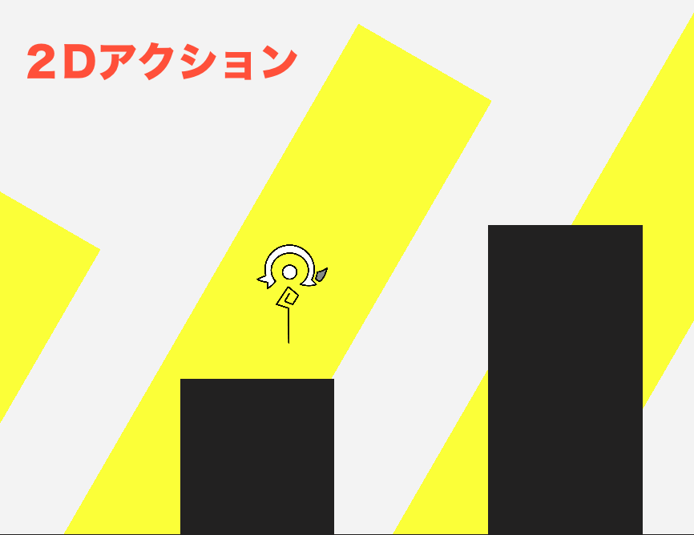

# HOP STEP JUMP

タイトル：HOP STEP JUMP  
ジャンル：2D アクション  
対象人数：1 人  
想定プレイ時間：5~10 分  
概要：常に飛び跳ね続けるキャラを操作してゴールを目指す 2D アクションゲーム  
  
制作人数：1 名 (yi-10maki)  
制作期間：2週間  
  

## 操作説明
← → : 左右移動  
↓ : 急降下  
X : 垂直ジャンプ  
Z : 右方向にジャンプ  
C : 左方向にジャンプ  
1, 2, Enter：ステージ選択に使用  
esc : ゲーム終了  
  
X，Z，C によるジャンプは着地の直前に入力することで発動します．  
X，Z，C によるジャンプは着地時の速度によって高さが異なるため，急降下などによって着地直前の落下速度を上昇させると通常より高く飛ぶことができます．

## WebGL
下記リンクをクリックすると WebGL 版が遊べます

[WebGL版](https://yi-10maki.github.io/hop_step_jump_web/)
